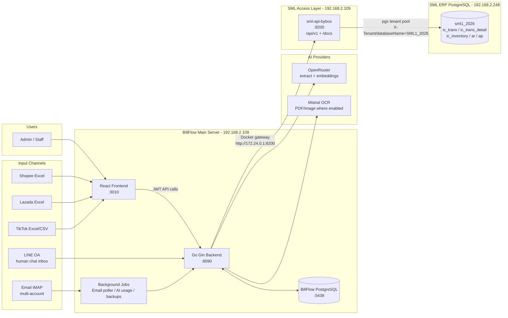
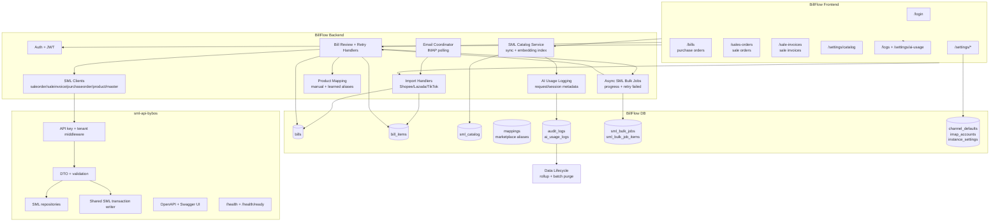
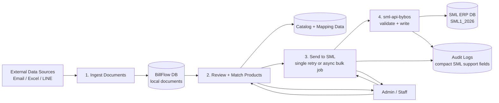
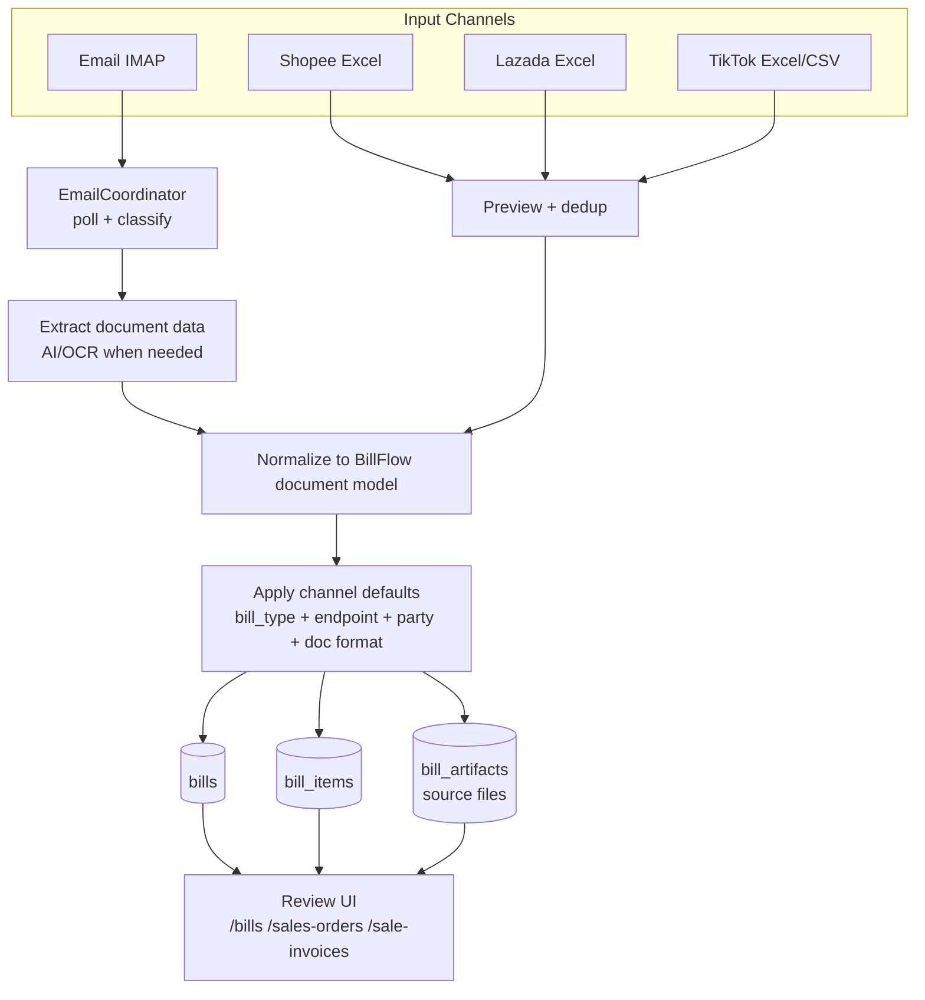
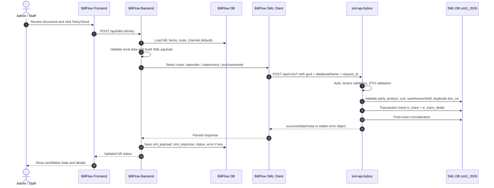
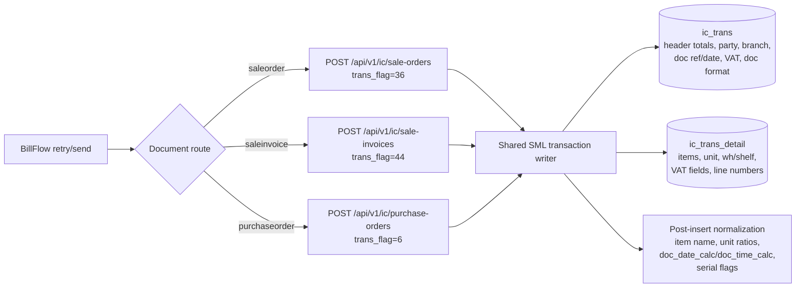
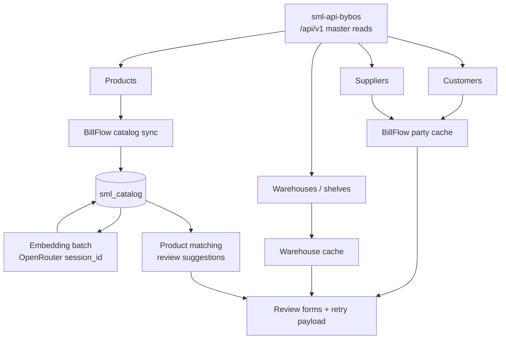
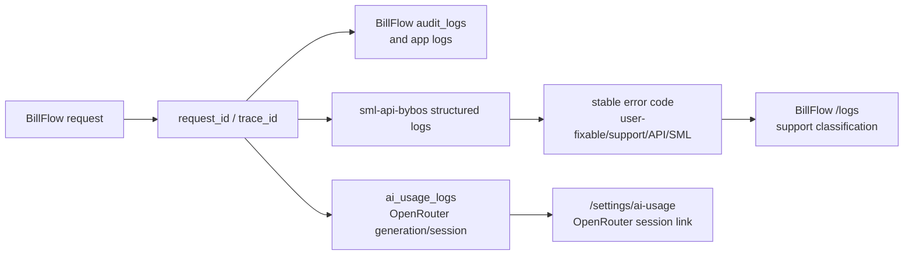
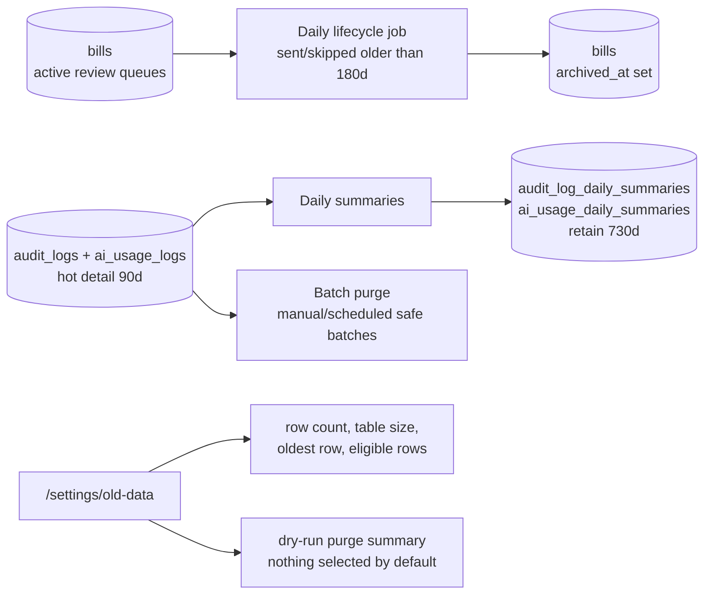
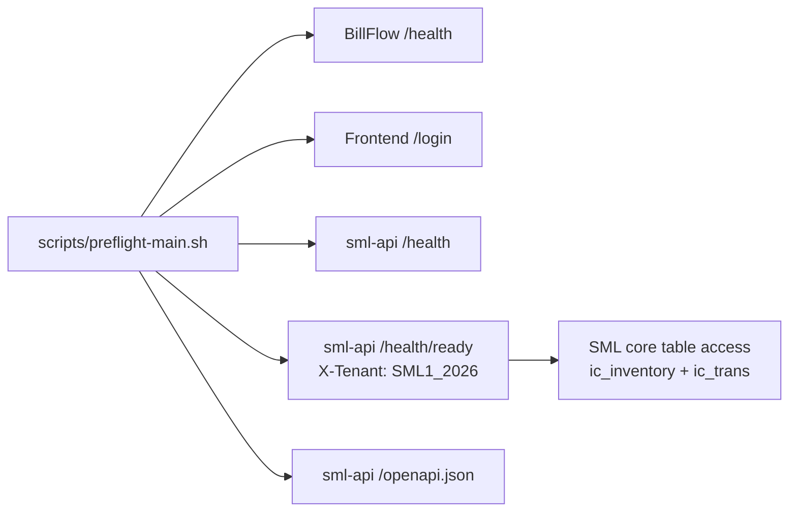

# BillFlow Main + sml-api-bybos Architecture & Data Flow

> Updated: 2026-05-20
> Scope: BillFlow main only (`backend :8090`, `frontend :3010`, tenant `SML1_2026`)  
> Out of scope for this document: Henna and Thaisunsport instances

---

## 1. Executive Summary

BillFlow main is the operational UI and workflow engine for turning marketplace/email documents into reviewed SML ERP documents. It receives data from Email, Shopee Excel, Lazada Excel, and TikTok Excel/CSV, stores them as local BillFlow documents, lets staff review product matching and routing, then sends the final document to SML through `sml-api-bybos`.

`sml-api-bybos` is now the production SML access layer for BillFlow main. BillFlow no longer depends on the old SML Java REST API directly for the main SML write/read routes. The API keeps BillFlow-native behavior, consistent response envelopes, request IDs, OpenAPI/Swagger docs, readiness checks, validation, duplicate handling, and SML table writes.

---

## 2. Runtime Architecture



### Runtime Ports

| Component | Host/Port | Purpose |
|---|---:|---|
| BillFlow frontend | `192.168.2.109:3010` | Staff UI |
| BillFlow backend | `192.168.2.109:8090` | Auth, document workflow, retry, logs |
| BillFlow PostgreSQL | `192.168.2.109:5438` | Local BillFlow state |
| sml-api-bybos | `192.168.2.109:8200` | BillFlow-native SML API |
| SML ERP database | `192.168.2.248:5432/sml1_2026` | SML ERP tables |

---

## 3. Main Component Architecture



---

## 4. Data Flow Diagram - Level 0



### Level 0 Explanation

| Step | What Happens | Main Data |
|---|---|---|
| 1. Ingest Documents | BillFlow imports email or marketplace files and creates local bills | source file/email, parsed header, parsed items |
| 2. Review + Match Products | Staff verifies party, route, item codes, units, warehouse/shelf, VAT | bill, bill_items, candidates, catalog, aliases |
| 3. Send to SML | Staff clicks retry/send or creates a bulk job; BillFlow builds SML payload per bill | saleorder, saleinvoice, purchaseorder payload, bulk job progress/results |
| 4. sml-api-bybos | API validates tenant/master data/totals and writes SML tables | `ic_trans`, `ic_trans_detail`, master lookups |

---

## 5. Data Flow Diagram - Level 1: Ingest to Review



### Important Rules

| Area | Rule |
|---|---|
| Local-first | Imported documents are stored in BillFlow before SML write |
| Human review | Staff can edit item code, unit, qty, price, route, party, warehouse, shelf |
| Retryable | Failed SML sends remain in BillFlow and can be retried |
| Source traceability | Source email/file/artifact and audit logs stay available for debugging |

---

## 6. Data Flow Diagram - Level 1: Review to SML



Bulk send uses the same send core as the single-bill retry path, but the browser first creates `POST /api/bills/bulk-send-jobs`. The backend stores `sml_bulk_jobs` + ordered `sml_bulk_job_items`, sends serially with concurrency `1`, polls progress through `GET /api/bills/bulk-send-jobs/:id`, and supports `retry-failed` as a new job that reuses the original payload snapshot.

---

## 7. SML Write Mapping



### SML API Response Contract

```json
{
  "success": true,
  "data": {},
  "meta": {
    "request_id": "..."
  }
}
```

```json
{
  "success": false,
  "error": {
    "code": "duplicate_doc_no",
    "message": "doc_no already exists",
    "details": {}
  }
}
```

BillFlow clients parse this contract directly and store the response in `bills.sml_response` for support/debugging. Audit logs keep compact debug summaries instead of copying full SML payload/response into every activity row.

---

## 8. Master Data and Catalog Flow



### Catalog Status

| Data | Purpose |
|---|---|
| `sml_catalog` | Local searchable copy of SML products |
| embeddings | Similarity search for product matching |
| OpenRouter `session_id` | Groups embedding/generation logs in OpenRouter Sessions |
| `/settings/catalog` | Shows sync, embed progress, ETA, and session link |

---

## 9. Observability and Support Flow



Detailed logs are hot data. BillFlow keeps `/logs` fast by using cursor pagination and by rolling detailed audit/AI usage rows into daily summaries before old detailed rows are purged in small batches.

### Typical Debug Order

1. Check BillFlow bill status and `sml_response`.
2. Check BillFlow `/logs` for user-facing error classification.
3. Check `sml-api-bybos` structured log by `request_id`, `doc_no`, or `trans_flag`.
4. Check SML tables `ic_trans` and `ic_trans_detail`.
5. If AI/extraction issue, open OpenRouter Sessions from `/settings/ai-usage`.

---

## 10. Production Data Lifecycle



### Lifecycle Rules

| Data | Hot Window | Long-Term Handling |
|---|---:|---|
| `bills` with `sent` / `skipped` | 180 days active | Auto-archive by setting `archived_at`; not deleted |
| `failed` bills | No auto-archive | Kept visible for human investigation |
| `audit_logs` detail | 90 days | Roll up to daily summary, then purge detail in batches |
| `ai_usage_logs` detail | 90 days | Roll up to daily summary, then purge detail in batches |
| Daily summaries | 730 days | Used for long-range old-data reporting |

### List API Rules

| Endpoint | Production Behavior |
|---|---|
| `/api/logs` | Cursor pagination with `limit`, `cursor`, `has_more`, `next_cursor`; no total unless `include_total=true` |
| `/api/bills` | Cursor pagination plus legacy `page/per_page`; supports `archived`, `date_from`, `date_to`; defaults to active rows only |
| `/api/bills/counts` | Counts review queues in one request for `/bills`, `/sales-orders`, and `/sale-invoices` |
| `/api/bills/bulk-send-jobs` | DB-backed async SML bulk send jobs; cap 100 bills, progress polling, history list, resume active job, retry failed only |

---

## 11. Deployment and Readiness Checks



### Production Acceptance Checklist

| Check | Expected |
|---|---|
| BillFlow backend | `GET /health` returns status OK |
| BillFlow frontend | `/login` loads current frontend asset |
| sml-api-bybos liveness | `/health` returns OK |
| sml-api-bybos readiness | `/health/ready` with `X-Tenant: SML1_2026` returns OK |
| OpenAPI | `/openapi.json` parses and Swagger UI loads at `/docs` |
| Catalog | Products synced and embeddings completed |
| Data lifecycle | Migration `037_data_lifecycle.sql` applied; `/api/bills/old-data/summary` returns policy and table metrics |
| Async bulk SML send | Migration `044_sml_bulk_jobs.sql` applied; one-bill smoke or 5-10 bill batch completes with accurate sent/failed/skipped counts |
| Golden SML write | SO/SI/PO test docs write to `ic_trans` and `ic_trans_detail` |

---

## 12. Failure Boundaries

| Boundary | Example Failure | Where It Appears | Recovery |
|---|---|---|---|
| Input parsing | Missing marketplace column or bad file | Import preview/confirm error | Fix file or column mapping |
| Product matching | Unknown product name | Review UI / marketplace aliases | Map item or create product |
| Local validation | Missing party, warehouse, shelf, unit | Retry validation error | Fix BillFlow settings/document |
| SML API validation | Duplicate `doc_no`, missing master data | Stable `error.code` from sml-api-bybos | Fix data or retry with correct doc number |
| SML DB write | Constraint/table/database issue | sml-api-bybos log + BillFlow failed status | Support investigates SML DB |
| AI provider | Timeout/rate/model error | `ai_usage_logs`, `/settings/ai-usage` | Retry or inspect OpenRouter session |

---

## 13. Source of Truth

| Topic | Source |
|---|---|
| BillFlow app workflow | `docs/overview.md` |
| Server/instance registry | `docs/deploy-instances.md` |
| Current deploy state | `docs/current-state.md` |
| sml-api-bybos migration notes | `docs/sml-api-migration.md` |
| sml-api-bybos API contract | `http://192.168.2.109:8200/docs` and `/openapi.json` |
| BillFlow main code | `/Users/nontawatwongnuk/dev_bos/billflow` |
| sml-api-bybos code | `/Users/nontawatwongnuk/dev/sml-api-bybos` |
