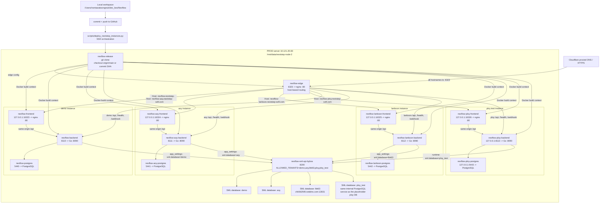

# Nexflow NextStep Production Deploy Flow

Updated: 2026-08-31

This is the current production server topology. The old `192.168.2.109` /
ngrok deployment is DEV/legacy only and must not be used for production deploys.

## Instances

| Instance | Public URL | Server folder | Frontend | Backend | Postgres | SML tenant |
| --- | --- | --- | --- | --- | --- | --- |
| demo | `https://nexflow.nextstep-soft.com` | `/mnt/data/nextstep-node-2/nexflow` | `127.0.0.1:16323 -> 80` | `8110 -> 8090` | `5440 -> 5432` | `demo` |
| aoy | `https://nexflow-aoy.nextstep-soft.com` | `/mnt/data/nextstep-node-2/nexflow-aoy` | `127.0.0.1:16324 -> 80` | `8111 -> 8090` | `5441 -> 5432` | `aoy` |
| lanboon | `https://nextflow-lanboon.nextstep-soft.com` | `/mnt/data/nextstep-node-2/nexflow-lanboon` | `127.0.0.1:16325 -> 80` | `8112 -> 8090` | `5442 -> 5432` | `lbk63` |
| ploy | `https://nexflow-ploy.nextstep-soft.com` | `/mnt/data/nextstep-node-2/nexflow-ploy` | `127.0.0.1:16326 -> 80` | `127.0.0.1:8113 -> 8090` | `127.0.0.1:5443 -> 5432` | `ploy_test` |

Public entrypoint:

```text
container: nexflow-edge
folder:    /mnt/data/nextstep-node-2/nexflow-edge
port:      6323 -> 80
routing:   by Host header
```

Shared SML gateway:

```text
container: nexflow-sml-api-bybos
port:      8200
tenants:   demo,aoy,lbk63,ploy,ploy_test
```

Each Nexflow instance has its own `.env`, Docker Compose file, Postgres volume,
`app_settings`, LINE/Shopee settings, and user data. Code should normally be the
same commit on all production instances.

Current application feature baseline (2026-08-28): Demo, AOY, and Lanboon run
`966b027`; each tenant keeps its own feature flags and configuration. Ploy runs
its isolated capability rollout `8dd7f2c`. The shared release/edge checkout is
also `8dd7f2c` and contains the complete four-tenant registry. A shared code
baseline does not authorize copying or enabling another tenant's settings.

## Diagram



## Standard Code Deploy

Use this when the code changes and all customer instances should run the same
version.

```bash
NX_PASS='<server-password>' python scripts/deploy_nextstep_instances.py --target all
```

The server-side deploy shape is:

```bash
cd /mnt/data/nextstep-node-2/nexflow-release
git fetch --prune origin
git checkout --detach origin/main

cd /mnt/data/nextstep-node-2/nexflow
docker compose up -d --build backend frontend

cd /mnt/data/nextstep-node-2/nexflow-aoy
docker compose up -d --build backend frontend

cd /mnt/data/nextstep-node-2/nexflow-lanboon
docker compose up -d --build backend frontend

cd /mnt/data/nextstep-node-2/nexflow-ploy
docker compose up -d --build backend frontend

cd /mnt/data/nextstep-node-2/nexflow-edge
docker compose up -d
```

Deploy only one instance when the change is intentionally isolated:

```bash
NX_PASS='<server-password>' python scripts/deploy_nextstep_instances.py --target demo
NX_PASS='<server-password>' python scripts/deploy_nextstep_instances.py --target aoy
NX_PASS='<server-password>' python scripts/deploy_nextstep_instances.py --target lanboon
NX_PASS='<server-password>' python scripts/deploy_nextstep_instances.py --target ploy
NX_PASS='<server-password>' python scripts/deploy_nextstep_instances.py --ref d52de63
```

The script:

- prepares `/mnt/data/nextstep-node-2/nexflow-release` as the server Git clone
- fetches GitHub and checks out a ref, default `origin/main`
- updates each instance compose file once so Docker build contexts point to the
  release clone and frontends bind to local-only debug ports
- updates and restarts `nexflow-edge`
- preserves each instance `.env`, `docker-compose.yml`, database volume,
  `backups/`, and `artifacts/`
- backs up `.env` and Postgres before rebuilding
- rebuilds and restarts `backend` + `frontend`
- smoke-tests backend health and `/login`
- smoke-tests selected hostnames through edge port `6323`
- scans recent backend logs for severe errors
- runs `scripts/check_sales_only_runtime.sh` before connecting to production

The application runtime is sales-only and deterministic. AI/OCR/embedding,
IMAP, LINE chat, and purchase workers must remain disabled. See
[`sales-only-no-ai.md`](sales-only-no-ai.md) for release and rollback checks.

It intentionally does not turn each instance folder into a Git checkout. The
instance folders remain config/runtime folders; the release clone is the source
of code truth.

## New Customer Onboarding

Use this flow for customers like Lanboon where the customer owns an external
PostgreSQL/SML server and Nexflow reads it through `sml-api-bybos`.

1. Collect customer inputs:
   - customer key, such as `lanboon`
   - public hostname, such as `nextflow-lanboon.nextstep-soft.com`
   - SML PostgreSQL host, port, database/tenant, user, password, sslmode

2. Confirm the production server can reach the customer DB before adding the app:

   ```bash
   ssh ubuntu@10.121.20.83
   timeout 5 bash -lc '</dev/tcp/<customer-pg-host>/<customer-pg-port>' && echo reachable
   ```

3. Add the instance registry row locally. The helper picks the next backend,
   local Postgres, and frontend debug ports when omitted.

   ```bash
   python3 scripts/nextstep_instance_registry.py suggest
   python3 scripts/nextstep_instance_registry.py add \
     --name <shop-key> \
     --hostname nextflow-<shop-key>.nextstep-soft.com \
     --sml-tenant <tenant-or-db-name> \
     --sml-host <customer-pg-host> \
     --sml-port <customer-pg-port>
   ```

   This updates `deploy/nextstep-instances.json` and re-renders the edge
   snapshots. It does not store the customer PG password.

4. Commit and push the registry/tooling change.

5. Bootstrap the server runtime folder using the registry values:
   - create `/mnt/data/nextstep-node-2/nexflow-<shop-key>`
   - create unique containers `nexflow-<shop-key>-postgres/backend/frontend`
   - create a fresh local Nexflow database volume, not a copy of another shop
   - generate fresh `DB_PASSWORD`, `JWT_SECRET`, `MEDIA_SIGNING_KEY`
   - set `PUBLIC_BASE_URL=https://nextflow-<shop-key>.nextstep-soft.com`
   - set `SHOPEE_SML_URL=http://172.17.0.1:8200`
   - set `SHOPEE_SML_PROVIDER=NEXT`, `SHOPEE_SML_CONFIG_FILE=SMLConfigNEXT.xml`
   - set `SHOPEE_SML_DATABASE=<tenant-or-db-name>`
   - keep Shopee/LINE disabled until configured per customer

   Use the fail-closed bootstrap command for a newly registered target. It
   refuses an existing folder, container, volume, occupied port, or a server
   with less than 8 GiB free. It also creates unique runtime/admin secrets and
   verifies that the fresh tenant has no bills, Shopee connections, mappings,
   or Catalog rows.

   ```bash
   NX_PASS='<server-password>' python3 scripts/deploy_nextstep_instances.py \
     --target <shop-key> --bootstrap-runtime --ref <reviewed-commit>
   ```

6. Add the customer tenant to `/mnt/data/nextstep-node-2/sml-api-bybos-nexflow/.env`
   and `nexflow-sml-api-bybos.runtime.env`:

   ```text
   ALLOWED_TENANTS=demo,aoy,lbk63,<new-tenant>
   SML_DB_HOST_<TENANT>=<customer-pg-host>
   SML_DB_PORT_<TENANT>=<customer-pg-port>
   SML_DB_USER_<TENANT>=<customer-pg-user>
   SML_DB_PASSWORD_<TENANT>=<customer-pg-password>
   SML_DB_SSLMODE_<TENANT>=disable
   ```

   Store the password only on the server. For read-only NextStep usage, ask the
   customer for a read-only PG user instead of `postgres`.

7. Test the tenant before exposing it:

   ```bash
   curl -s -H 'x-tenant: <tenant>' http://localhost:8200/health/ready
   curl -s -H 'x-tenant: <tenant>' -H 'x-api-key: smlx' \
     'http://localhost:8200/api/v1/marketplace/nextstep/orders?date_from=YYYY-MM-DD&date_to=YYYY-MM-DD&include_orders=false&page_size=5'
   ```

8. Deploy the registered target:

   ```bash
   NX_PASS='<server-password>' python3 scripts/deploy_nextstep_instances.py --target <shop-key>
   ```

9. Send IT the Cloudflare message printed by:

   ```bash
   python3 scripts/nextstep_instance_registry.py it-message --hostname nextflow-<shop-key>.nextstep-soft.com
   ```

10. Smoke after DNS/proxy:
    - `/login`
    - `/health`
    - `/dashboard`
    - `/nextstep-marketplace`
    - local Nexflow DB has no bills from other shops
    - the resolved runtime SML tenant equals the customer tenant, and no stale
      `app_settings.sml.database` row overrides the deployment `.env`

## Per-Instance Config

Use the UI or `app_settings` for customer-specific settings. Do not solve
customer-specific config by changing shared code.

| Config type | Scope |
| --- | --- |
| LINE OA sender/recipients | per instance |
| Shopee connections/OAuth | per instance |
| SML tenant/database | per instance |
| Users/passwords | per instance |
| Feature flags in `.env` | per instance |
| Backend/frontend code | normally all instances |

Current AOY focus:

```text
PUBLIC_BASE_URL=https://nexflow-aoy.nextstep-soft.com
sml.database=aoy
sml.provider=NEXT
sml.config_file=SMLConfigNEXT.xml
sml.rest_base_url=http://172.17.0.1:8200
Shopee realtime/API is enabled as AOY's temporary shared-app fallback until a
dedicated Shopee Open Platform app passes OAuth, token, sync, and preview smoke.
```

Current Lanboon focus:

```text
PUBLIC_BASE_URL=https://nextflow-lanboon.nextstep-soft.com
sml.database=lbk63
sml.provider=NEXT
sml.config_file=SMLConfigNEXT.xml
sml.rest_base_url=http://172.17.0.1:8200
Shopee/LINE settings are customer-specific and start unconfigured
```

Current Ploy staging status (2026-08-31):

```text
PUBLIC_BASE_URL=https://nexflow-ploy.nextstep-soft.com
sml.database=ploy_test
sml.provider=NEXT
sml.config_file=SMLConfigNEXT.xml
sml.rest_base_url=http://172.17.0.1:8200
local Nexflow DB: 1 bootstrap admin, 0 bills, 0 Shopee connections,
                  0 marketplace mappings, 0 Catalog rows
```

Ploy is an isolated test tenant; no AOY database, user, OAuth token, order,
mapping, or setting was copied. Its global feature surface is now aligned with
AOY where safe, so admins can configure Ploy's own connection and routes:

```text
MARKETPLACE_UNIT_CATALOG_ENABLED=true
MARKETPLACE_CONVERSION_MODE=shadow
MARKETPLACE_RESERVATION_LEDGER_ENABLED=true
SHOPEE_OPEN_API_ENABLED=true
ENABLE_SHOPEE_REALTIME_OPS=true
SHOPEE_AUTO_SML_ENABLED=true
SHOPEE_AUTO_SML_CANCEL_ENABLED=true
SHOPEE_SET_STOCK_ENABLED=true
SML_SET_PRODUCT_EXPANSION_ENABLED=true
```

The SML Gateway can connect to database `ploy_test`, but its product and stock-
Catalog endpoints still return zero rows. There is no active generation and
conversion readiness is false for Catalog, mapping, and reservations. Do not
change conversion from `shadow` to `active` until the SML team has populated
products and `ic_unit_use`, a generation activates, and both reconciliation
jobs pass. The backend intentionally refuses to start with active conversion
before those gates pass.

Ploy currently has no Shopee connection, per-shop stock setting, per-shop Auto
SML setting, LINE recipient, mapping, or bill. Global enablement exposes the
configuration UI but cannot create an external write by itself. Connect Ploy's
own Shopee shop, configure sale/cancellation routes and LINE, sync the Catalog,
map products, and pass Dry-run before enabling each shop's automation.

The public DNS, origin TLS certificate, HTTP-to-HTTPS redirect, edge Host route,
`/login`, and `/health` now pass. Ploy's bootstrap administrator has been
rotated to `admin@nexflow.local` with a unique random password delivered through
the operator's local clipboard. Its pre-rotation environment and database
backups are retained under the Ploy backup folder.

Every future fresh tenant uses `admin@nexflow.local` as the bootstrap email and
generates a different 32+ character password at deploy time. Never hard-code or
reuse `admin1234` (or another shared password) across tenants. Keep the generated
secret only in the mode-0600 server runtime environment, hand it off through an
approved secure channel, and rotate it after the first login.

## Central Shopee Gateway

Production uses one central Shopee Open Platform app and
`shopee-gateway.nextstep-soft.com`. Tenant hostnames remain separate; path-based
tenancy is not used. The gateway owns Partner credentials, encrypted tokens,
OAuth, push, token refresh, and the typed Shopee API proxy.

Deploy the gateway target before customer instances:

```bash
NX_PASS='<server-password>' python scripts/deploy_nextstep_instances.py --target gateway
```

`--target all` deploys/checks the gateway and then all instances. Per-tenant
deploys also install a derived HMAC identity used for route discovery while
preserving each instance's current Shopee mode. Per-tenant cutover remains
explicit and starts with AOY. Verify `shop_routes` covers every active direct
shop before changing the global Shopee callback. See
`docs/shopee-gateway-runbook.md` for Shopee Console values, provisioning,
canary checks, and direct-mode rollback.

Every registry row also carries `gateway_backend_url`. New private tenants use
the backend container DNS name on `nexflow-shopee-gateway_default`, for example
`http://nexflow-ploy-backend:8090`; do not point the gateway at a host port that
is bound to `127.0.0.1`. A tenant deploy verifies the exact enabled tenant row,
public base URL, and backend URL in the gateway database. If registration is
missing or stale it restarts the gateway and waits for the committed registry
to sync. Gateway deploys force-recreate the container because the registry is a
mounted file and an unchanged image alone does not reload it.

## Smoke Checks

```bash
ssh ubuntu@10.121.20.83

# Containers
sudo docker ps --format '{{.Names}} {{.Status}} {{.Ports}}' | grep -E 'nexflow|sml-api'

# Edge public entrypoint
curl -s -o /dev/null -w '%{http_code}\n' -H 'Host: nexflow.nextstep-soft.com' http://localhost:6323/login
curl -s -o /dev/null -w '%{http_code}\n' -H 'Host: nexflow-aoy.nextstep-soft.com' http://localhost:6323/login
curl -s -o /dev/null -w '%{http_code}\n' -H 'Host: nextflow-lanboon.nextstep-soft.com' http://localhost:6323/login
curl -s -o /dev/null -w '%{http_code}\n' -H 'Host: nexflow-ploy.nextstep-soft.com' http://localhost:6323/login

# Demo debug/direct
curl -s http://localhost:8110/health
curl -s -o /dev/null -w '%{http_code}\n' http://127.0.0.1:16323/login

# AOY debug/direct
curl -s http://localhost:8111/health
curl -s -o /dev/null -w '%{http_code}\n' http://127.0.0.1:16324/login

# Lanboon debug/direct
curl -s http://localhost:8112/health
curl -s -o /dev/null -w '%{http_code}\n' http://127.0.0.1:16325/login

# Ploy debug/direct
curl -s http://localhost:8113/health
curl -s -o /dev/null -w '%{http_code}\n' http://127.0.0.1:16326/login

# SML gateway
curl -s -H 'x-tenant: demo' http://localhost:8200/health/ready
curl -s -H 'x-tenant: aoy' http://localhost:8200/health/ready
curl -s -H 'x-tenant: lbk63' http://localhost:8200/health/ready
curl -s -H 'x-tenant: ploy_test' http://localhost:8200/health/ready
```

## Cloudflare / IT Routing

The domains can use the same CNAME target from IT when they land on the same
server/router. All hostnames should route to the same origin:

| Hostname | Origin |
| --- | --- |
| `nexflow.nextstep-soft.com` | `http://10.121.20.83:6323` |
| `nexflow-aoy.nextstep-soft.com` | `http://10.121.20.83:6323` |
| `nextflow-lanboon.nextstep-soft.com` | `http://10.121.20.83:6323` |
| `nexflow-ploy.nextstep-soft.com` | `http://10.121.20.83:6323` |

If Cloudflare returns 525, the origin/proxy SSL mode is wrong for the origin.
Keep Cloudflare public HTTPS, but proxy to the internal HTTP port above unless
IT installs an origin certificate on the reverse proxy.

## Legacy DEV Only

The old deployment below is no longer production:

```text
192.168.2.109
animal-galvanize-tameness.ngrok-free.dev
/home/bosscatdog/billflow-henna
frontend 3030
```

Use it only as a historical/dev reference.
