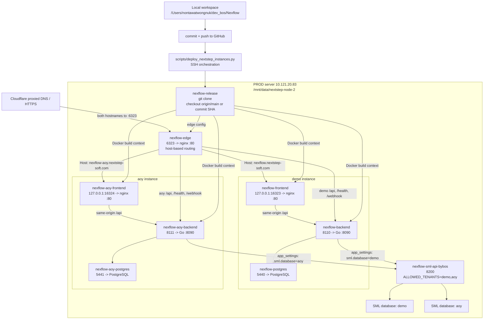

# Nexflow NextStep Production Deploy Flow

Updated: 2026-07-08

This is the current production server topology. The old `192.168.2.109` /
ngrok deployment is DEV/legacy only and must not be used for production deploys.

## Instances

| Instance | Public URL | Server folder | Frontend | Backend | Postgres | SML tenant |
| --- | --- | --- | --- | --- | --- | --- |
| demo | `https://nexflow.nextstep-soft.com` | `/mnt/data/nextstep-node-2/nexflow` | `127.0.0.1:16323 -> 80` | `8110 -> 8090` | `5440 -> 5432` | `demo` |
| aoy | `https://nexflow-aoy.nextstep-soft.com` | `/mnt/data/nextstep-node-2/nexflow-aoy` | `127.0.0.1:16324 -> 80` | `8111 -> 8090` | `5441 -> 5432` | `aoy` |

Public entrypoint:

```text
container: nexflow-edge
folder:    /mnt/data/nextstep-node-2/nexflow-edge
port:      6323 -> 80
routing:   by Host header
```

Shared SML gateway:

```text
container: nexflow-sml-api-bybos
port:      8200
tenants:   demo,aoy
```

Each Nexflow instance has its own `.env`, Docker Compose file, Postgres volume,
`app_settings`, LINE/Shopee settings, and user data. Code should normally be the
same commit on both instances.

## Diagram



## Standard Code Deploy

Use this when the code changes and both customer instances should run the same
version.

```bash
NX_PASS='<server-password>' python scripts/deploy_nextstep_instances.py --target all
```

The server-side deploy shape is:

```bash
cd /mnt/data/nextstep-node-2/nexflow-release
git fetch --prune origin
git checkout --detach origin/main

cd /mnt/data/nextstep-node-2/nexflow
docker compose up -d --build backend frontend

cd /mnt/data/nextstep-node-2/nexflow-aoy
docker compose up -d --build backend frontend

cd /mnt/data/nextstep-node-2/nexflow-edge
docker compose up -d
```

Deploy only one instance when the change is intentionally isolated:

```bash
NX_PASS='<server-password>' python scripts/deploy_nextstep_instances.py --target demo
NX_PASS='<server-password>' python scripts/deploy_nextstep_instances.py --target aoy
NX_PASS='<server-password>' python scripts/deploy_nextstep_instances.py --ref d52de63
```

The script:

- prepares `/mnt/data/nextstep-node-2/nexflow-release` as the server Git clone
- fetches GitHub and checks out a ref, default `origin/main`
- updates each instance compose file once so Docker build contexts point to the
  release clone and frontends bind to local-only debug ports
- updates and restarts `nexflow-edge`
- preserves each instance `.env`, `docker-compose.yml`, database volume,
  `backups/`, and `artifacts/`
- backs up `.env` and Postgres before rebuilding
- rebuilds and restarts `backend` + `frontend`
- smoke-tests backend health and `/login`
- smoke-tests both hostnames through edge port `6323`
- scans recent backend logs for severe errors

It intentionally does not turn each instance folder into a Git checkout. The
instance folders remain config/runtime folders; the release clone is the source
of code truth.

## Per-Instance Config

Use the UI or `app_settings` for customer-specific settings. Do not solve
customer-specific config by changing shared code.

| Config type | Scope |
| --- | --- |
| LINE OA sender/recipients | per instance |
| Shopee connections/OAuth | per instance |
| SML tenant/database | per instance |
| Users/passwords | per instance |
| Feature flags in `.env` | per instance |
| Backend/frontend code | normally both instances |

Current AOY focus:

```text
PUBLIC_BASE_URL=https://nexflow-aoy.nextstep-soft.com
sml.database=aoy
sml.provider=NEXT
sml.config_file=SMLConfigNEXT.xml
sml.rest_base_url=http://172.17.0.1:8200
Shopee realtime/API disabled until explicitly enabled
```

## Smoke Checks

```bash
ssh ubuntu@10.121.20.83

# Containers
sudo docker ps --format '{{.Names}} {{.Status}} {{.Ports}}' | grep -E 'nexflow|sml-api'

# Edge public entrypoint
curl -s -o /dev/null -w '%{http_code}\n' -H 'Host: nexflow.nextstep-soft.com' http://localhost:6323/login
curl -s -o /dev/null -w '%{http_code}\n' -H 'Host: nexflow-aoy.nextstep-soft.com' http://localhost:6323/login

# Demo debug/direct
curl -s http://localhost:8110/health
curl -s -o /dev/null -w '%{http_code}\n' http://127.0.0.1:16323/login

# AOY debug/direct
curl -s http://localhost:8111/health
curl -s -o /dev/null -w '%{http_code}\n' http://127.0.0.1:16324/login

# SML gateway
curl -s -H 'x-tenant: demo' http://localhost:8200/health/ready
curl -s -H 'x-tenant: aoy' http://localhost:8200/health/ready
```

## Cloudflare / IT Routing

The two domains can use the same CNAME target from IT when they land on the same
server/router. Both hostnames should route to the same origin:

| Hostname | Origin |
| --- | --- |
| `nexflow.nextstep-soft.com` | `http://10.121.20.83:6323` |
| `nexflow-aoy.nextstep-soft.com` | `http://10.121.20.83:6323` |

If Cloudflare returns 525, the origin/proxy SSL mode is wrong for the origin.
Keep Cloudflare public HTTPS, but proxy to the internal HTTP port above unless
IT installs an origin certificate on the reverse proxy.

## Legacy DEV Only

The old deployment below is no longer production:

```text
192.168.2.109
animal-galvanize-tameness.ngrok-free.dev
/home/bosscatdog/billflow-henna
frontend 3030
```

Use it only as a historical/dev reference.
