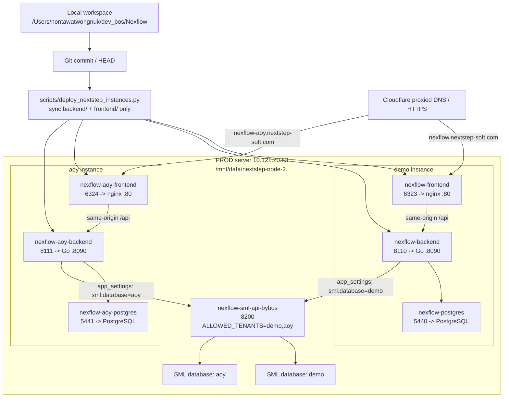

# Nexflow NextStep Production Deploy Flow

Updated: 2026-07-08

This is the current production server topology. The old `192.168.2.109` /
ngrok deployment is DEV/legacy only and must not be used for production deploys.

## Instances

| Instance | Public URL | Server folder | Frontend | Backend | Postgres | SML tenant |
| --- | --- | --- | --- | --- | --- | --- |
| demo | `https://nexflow.nextstep-soft.com` | `/mnt/data/nextstep-node-2/nexflow` | `6323 -> 80` | `8110 -> 8090` | `5440 -> 5432` | `demo` |
| aoy | `https://nexflow-aoy.nextstep-soft.com` | `/mnt/data/nextstep-node-2/nexflow-aoy` | `6324 -> 80` | `8111 -> 8090` | `5441 -> 5432` | `aoy` |

Shared SML gateway:

```text
container: nexflow-sml-api-bybos
port:      8200
tenants:   demo,aoy
```

Each Nexflow instance has its own `.env`, Docker Compose file, Postgres volume,
`app_settings`, LINE/Shopee settings, and user data. Code should normally be the
same commit on both instances.

## Diagram



## Standard Code Deploy

Use this when the code changes and both customer instances should run the same
version.

```bash
NX_PASS='<server-password>' python scripts/deploy_nextstep_instances.py --target all
```

Deploy only one instance when the change is intentionally isolated:

```bash
NX_PASS='<server-password>' python scripts/deploy_nextstep_instances.py --target demo
NX_PASS='<server-password>' python scripts/deploy_nextstep_instances.py --target aoy
```

The script:

- deploys a committed git ref only, default `HEAD`
- syncs `backend/` and `frontend/`
- preserves each instance `.env`, `docker-compose.yml`, database volume,
  `backups/`, and `artifacts/`
- backs up `.env` and Postgres before rebuilding
- rebuilds and restarts `backend` + `frontend`
- smoke-tests backend health and `/login`
- scans recent backend logs for severe errors

It intentionally does not sync `docker-compose.yml` because the two instances
use different ports, container names, and volumes.

## Per-Instance Config

Use the UI or `app_settings` for customer-specific settings. Do not solve
customer-specific config by changing shared code.

| Config type | Scope |
| --- | --- |
| LINE OA sender/recipients | per instance |
| Shopee connections/OAuth | per instance |
| SML tenant/database | per instance |
| Users/passwords | per instance |
| Feature flags in `.env` | per instance |
| Backend/frontend code | normally both instances |

Current AOY focus:

```text
PUBLIC_BASE_URL=https://nexflow-aoy.nextstep-soft.com
sml.database=aoy
sml.provider=NEXT
sml.config_file=SMLConfigNEXT.xml
sml.rest_base_url=http://172.17.0.1:8200
Shopee realtime/API disabled until explicitly enabled
```

## Smoke Checks

```bash
ssh ubuntu@10.121.20.83

# Containers
sudo docker ps --format '{{.Names}} {{.Status}} {{.Ports}}' | grep -E 'nexflow|sml-api'

# Demo
curl -s http://localhost:8110/health
curl -s -o /dev/null -w '%{http_code}\n' http://localhost:6323/login

# AOY
curl -s http://localhost:8111/health
curl -s -o /dev/null -w '%{http_code}\n' http://localhost:6324/login

# SML gateway
curl -s -H 'x-tenant: demo' http://localhost:8200/health/ready
curl -s -H 'x-tenant: aoy' http://localhost:8200/health/ready
```

## Cloudflare / IT Routing

The two domains can use the same CNAME target from IT when they land on the same
server/router. The reverse proxy must route by hostname:

| Hostname | Origin |
| --- | --- |
| `nexflow.nextstep-soft.com` | `http://10.121.20.83:6323` |
| `nexflow-aoy.nextstep-soft.com` | `http://10.121.20.83:6324` |

If Cloudflare returns 525, the origin/proxy SSL mode is wrong for the origin.
Keep Cloudflare public HTTPS, but proxy to the internal HTTP port above unless
IT installs an origin certificate on the reverse proxy.

## Legacy DEV Only

The old deployment below is no longer production:

```text
192.168.2.109
animal-galvanize-tameness.ngrok-free.dev
/home/bosscatdog/billflow-henna
frontend 3030
```

Use it only as a historical/dev reference.
